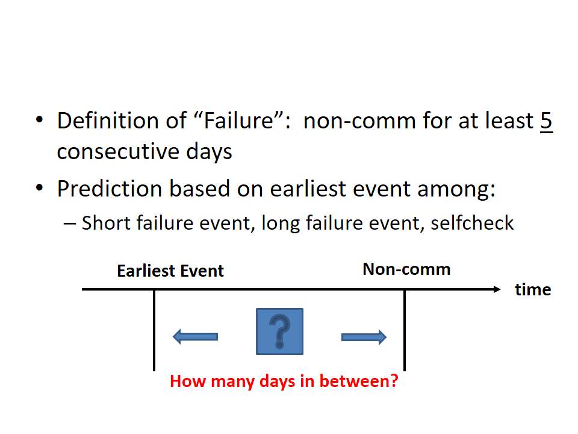
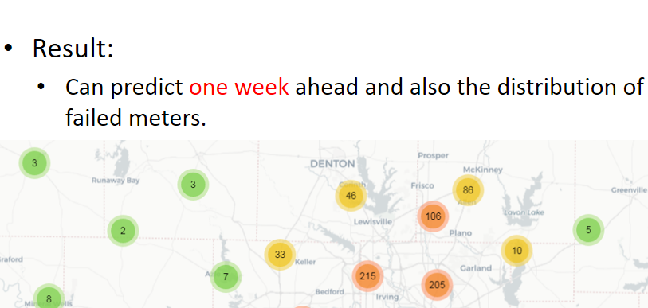

# Power Metering Failure Predictive Models

#### This repo provides predictive machine learning solutions for power company to identify potential electric metering failures based on data science.

#### Goal: reduce cost for replacing electric meters and reduce potential costs due to metering failures.

